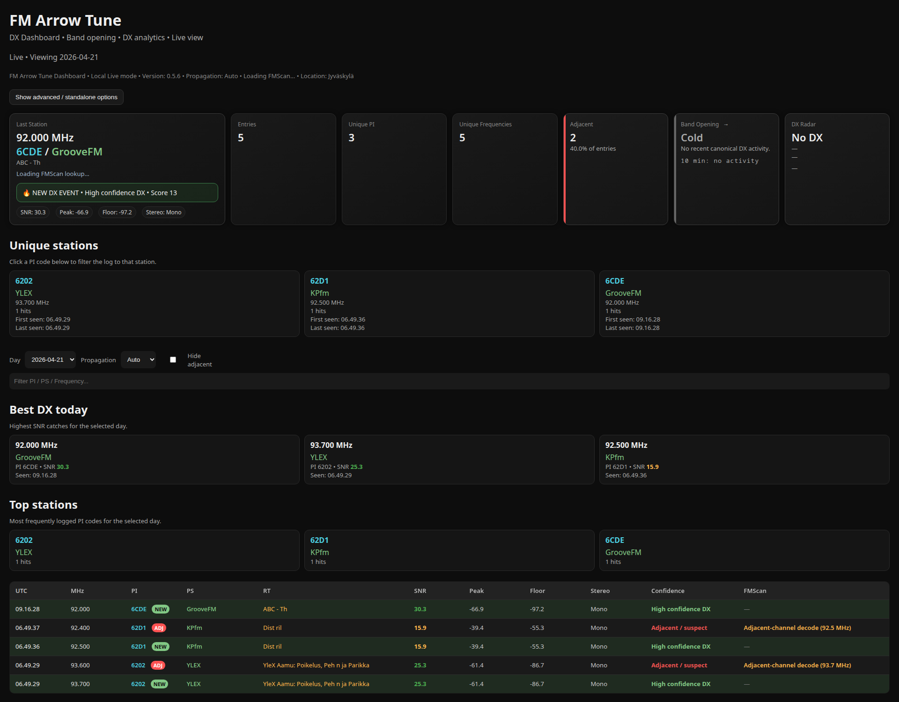

# FM Arrow Tune (DX Data Tool)


SDR# plugin for FM DX logging, signal analysis and real-time monitoring — now with optional live dashboard support.

---

## 📸 Screenshot



---

## 🚀 Features

- keyboard-driven FM tuning and scanning
- hold-to-scan and auto scan
- PI-first logging
- optional Radiotext capture
- signal metrics:
  - SNR
  - Peak
  - Noise Floor
  - Stereo / Mono
- TXT / CSV / JSON logging
- daily log folders
- invalid PI filtering
- station settle time (prevents early false RDS logging)
- optional live dashboard
- optional FMScan / FMLIST enrichment
- confidence score
- DX event detection

👉 This is no longer just a tuning helper — it's a compact DX analysis tool.

---

## ⚡ Quick Start

1. Download the latest release  
2. Extract ZIP  
3. Copy plugin into SDR# Plugins folder  
4. Start SDR#  
5. Enable **FM Arrow Tune**

Optional:

6. Open `dashboard.html` to view logs visually

---

## ⌨️ Keyboard Shortcuts

- Left / Right = step tuning  
- Up / Down = jump tuning  
- Hold arrow = continuous scan  
- F8 = auto scan up  
- F7 = auto scan down  
- Esc = stop scanning  

---

## 📊 Dashboard (optional)

Starting with **v0.5.0**, FM Arrow Tune includes a live dashboard.

### Features

- Last Station panel
- daily log viewer
- unique PI list
- Best DX today
- Top stations
- confidence score
- DX event banner
- FMScan lookup (optional)

👉 The dashboard is **fully optional**  
👉 The plugin works normally without it

---

## 📁 Folder Structure

```text
live/
  dashboard.html
  FMArrowTune_latest.json
  index.json
  2026-04-10/
    FMArrowTune.json
```

📡 FMScan / FMLIST Support (optional)

No station database is bundled.

Users can manually download CSV files from FMScan:
	•	https://fmscan.org/

Place them here:

``` text
live/
  fmscan/
    fmscan-tropo.csv
    fmscan-es.csv
    fmscan-ms.csv
```

Lookup priority (Auto mode)
- Tropo
- Sporadic E
- Meteor Scatter

👉 FMScan data is used as enrichment only, not as absolute truth.

⸻

⚙️ Recommended Defaults
	•	Scan speed: 120 ms
	•	Auto dwell: 1200 ms
	•	Station settle time: 1000 ms

⸻

🧠 How it evolved

Originally built for simple keyboard tuning (especially for remote SDR use via iPad + Splashtop),
FM Arrow Tune has grown into a full DX workflow tool:

scan → detect → validate → log → analyze

⸻

📦 Release

Current version: v0.5.0

Highlights
	•	🔥 Live dashboard
	•	📊 Signal metrics logging
	•	⏱️ Station settle time
	•	🧠 Confidence scoring
	•	📡 DX event detection
	•	🌍 FMScan enrichment (optional)

⸻

📜 License

MIT
