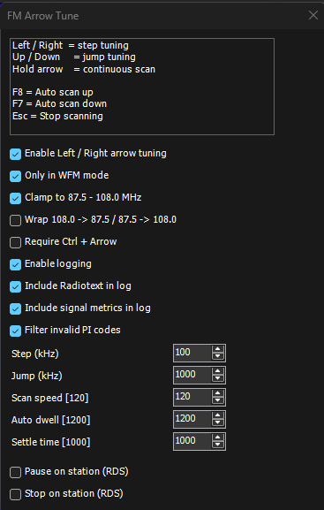

# 🚀 FM Arrow Tune  
### Real-time FM DX Monitoring Platform for SDR#

> From simple arrow tuning → to a full live DX intelligence system

---

## 📸 Live Dashboard

Example:

---

## 🔥 What is this?

FM Arrow Tune is no longer just a plugin.

It’s a **complete FM DX monitoring ecosystem**:

- 🎯 Fast arrow-key band scanning  
- 📡 Real-time DX logging  
- 🌐 Live dashboard in browser  
- ⚡ One-click launcher (no setup)  
- 🧠 DX intelligence (openings, bursts, scoring)  
- 🌍 Station identification (FMScan)  

---

## ⚡ 2-Minute Setup

1. Copy plugin → SDR# Plugins folder  
2. Enable logging in plugin  
3. Run:

FmArrowTune-Launcher.exe

👉 Dashboard opens automatically  
👉 Live DX starts immediately  

---

## 🖥️ Operating Modes

| Mode           | Description |
|----------------|------------|
| **Manual**     | Open dashboard manually |
| **Local Live** | ✅ Recommended – plug & play |
| **Remote Live**| Advanced – run on your own server |

---

### 🔁 Local Live vs Remote Live

Both modes are **identical in functionality**.

- **Local Live** → easiest, runs locally  
- **Remote Live** → for advanced users (server / sharing)

👉 Remote Live does NOT add new features  
👉 It only changes where the dashboard runs  

---

## 🌐 Live Demo

https://vadelma.online/live/dashboard.html  

---

## 📦 Download

https://github.com/YOUR_REPO/releases/latest  

---

## 📊 FMScan Integration

Enhances DX experience with:

- 🌍 Country detection  
- 📏 Distance calculation  
- 🎯 Smarter DX scoring  

⚠️ Requires manual download from FMList  
(see START_HERE.txt)

---

## 🧠 DX Intelligence Engine

Built-in analysis includes:

- 📈 Band opening detection  
- 🔥 DX burst detection  
- 🚫 Adjacent signal filtering  
- 🎯 Confidence scoring  

---

## 🛰️ Built for DXers

Works perfectly with:

- SDR#  
- TEF6686 setups  
- AirSpy / RTL-SDR  
- FM-DX-Webserver workflows  

---

## 🛠️ Advanced Use

- 🌍 Remote Live (server / Raspberry Pi)
- 📡 Multi-device monitoring
- 📊 Session analysis
- 🔧 Custom FMScan lists

---

## ❤️ Credits

Huge thanks to:

- Paolo Romani (IZ1MLL) – feedback & ideas  
- FMList / FMScan community  
- SDR / DX community  

---

## 🔮 Roadmap

- 🗺️ DX map view (paths & bearings)  
- 📡 Distance visualization  
- 📈 Session analytics  

---

## ⭐ If you like this project

Give it a star — it helps a lot 🙏  

---

73 and good DX!
